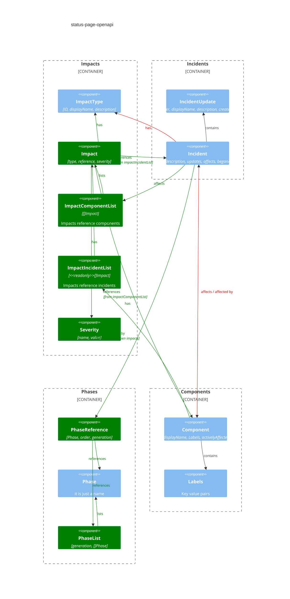

# Component Overview

This represents a part of the decision process related to the overall structure the API wants to represent.

Color meaning:

- Blue: Existing structure
- Red: Deprecated / removed
- Green: New
